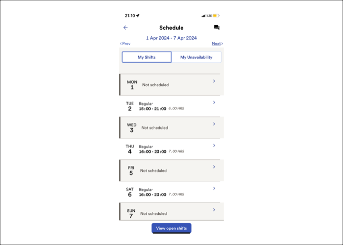

Proof of Concept
================

Here’s a proof of concept to see if we can read my work schedule and
automatically create a calendar link from it.

``` r
library(tesseract)
library(lubridate)
```


    Attaching package: 'lubridate'

    The following objects are masked from 'package:base':

        date, intersect, setdiff, union

``` r
library(dplyr)
```


    Attaching package: 'dplyr'

    The following objects are masked from 'package:stats':

        filter, lag

    The following objects are masked from 'package:base':

        intersect, setdiff, setequal, union

``` r
library(stringr)
library(purrr)
library(glue)
library(calendar)
```

Here’s the input file:

``` r
infile <- here::here("IMG_0579.PNG")
```

``` r
showimage::show_image(infile)
```



``` r
eng <- tesseract("eng")
text <- tesseract::ocr(infile, engine = eng)
cat(text)
```

    21:10 4 eat! LTE @_)
    € Schedule LT]
    1 Apr 2024 - 7 Apr 2024
    <Prev Next>

    My Shifts My Unavailability
    >
    MON Not scheduled
    1
    TUE Regular >
    2 15:00-21:00 6.00HRS
    >
    WED Not scheduled
    3
    THU Regular >
    4  16:00-23:00 7.00HRS
    >
    FRI Not scheduled
    5
    SAT Regular >
    6  16:00-23:00 7.00HRS
    >
    SUN Not scheduled
    7
    View open shifts

It looks like it takes the text out quite nicely. Now we need to get
some functions together to read the different parts:

``` r
get_week <- function(lines) {

    tryCatch(
        {
            dateline <- lines[3]

            dateline %>% 
                str_split_1(pattern = " - ") %>%
                dmy()
        },

        error = function(cond) {
            message("Error parsing week of shift")
            message("Here's the original error message:")
            message(conditionMessage(cond))
            # Choose a return value in case of error
            stop()
        }
    )

}

get_shifts <- function(lines) {

    shifts <- list()

    for(l in seq_along(lines)){

        if(str_detect(lines[l], "Regular")){

            # print(lines[l]) # shift detected
            # print(lines[l+1]) # date and time

            day_of_shift <- lines[l] %>%
                str_split_1(., " +") %>%
                pluck(1)

            date_of_shift <- lines[l+1] %>%
                str_split_1(., " +") %>%
                pluck(1)

            start_time <- lines[l+1] %>%
                str_split_1(., " +") %>%
                pluck(2) %>%
                str_split_1(., "-") %>%
                pluck(1)

            end_time <- lines[l+1] %>%
                str_split_1(., " +") %>%
                pluck(2) %>%
                str_split_1(., "-") %>%
                pluck(2)

            shifts[[l]] <- c(day = day_of_shift, date = date_of_shift, start = start_time, end = end_time)
        
        }
    }

    shifts <- compact(shifts)

    return(bind_rows(shifts))
}
```

Putting it together:

``` r
week_ <- text %>% 
    str_split_1("\n") %>% 
    get_week()

shifts <- text %>% 
    str_split_1("\n") %>% 
    get_shifts()

shifts %>%
    mutate(start_of_week = ymd(week_[[1]])) %>%
    rowwise() %>% 
    mutate(shift = paste0(c(day, date, month(start_of_week), year(start_of_week)), collapse=" ")) %>%
    mutate(start_processed = paste0(c(shift, start), collapse = " "), end_processed = paste0(c(shift, end), collapse = " ")) %>%
    mutate(start_processed = dmy_hm(start_processed, tz = "America/New_York"), end_processed = dmy_hm(end_processed, tz = "America/New_York")) %>%
    ungroup() -> processed_shifts

icals <- c()

for(l in 1:nrow(processed_shifts)) {
    

    icals[[l]] <-  

        ic_event(
            start_time = processed_shifts$start_processed[l],
            end_time = processed_shifts$end_processed[l],

            summary = glue("TT Reservoir (autogenerated)\n\n{processed_shifts$shift[l]} from {processed_shifts$start[l]} to {processed_shifts$end[l]}. \n\nAutogenerated {now()}"),
            
        )
}

bind_rows(icals) %>% ical() %>% ic_write(., "test.ics")
```

Looks like this works! We can write out a schedule from a screenshot!
